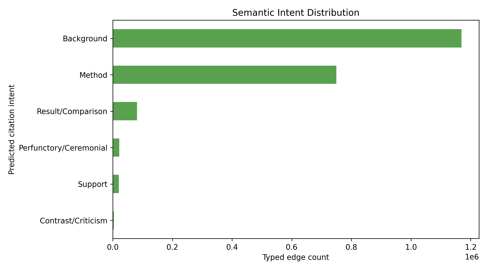
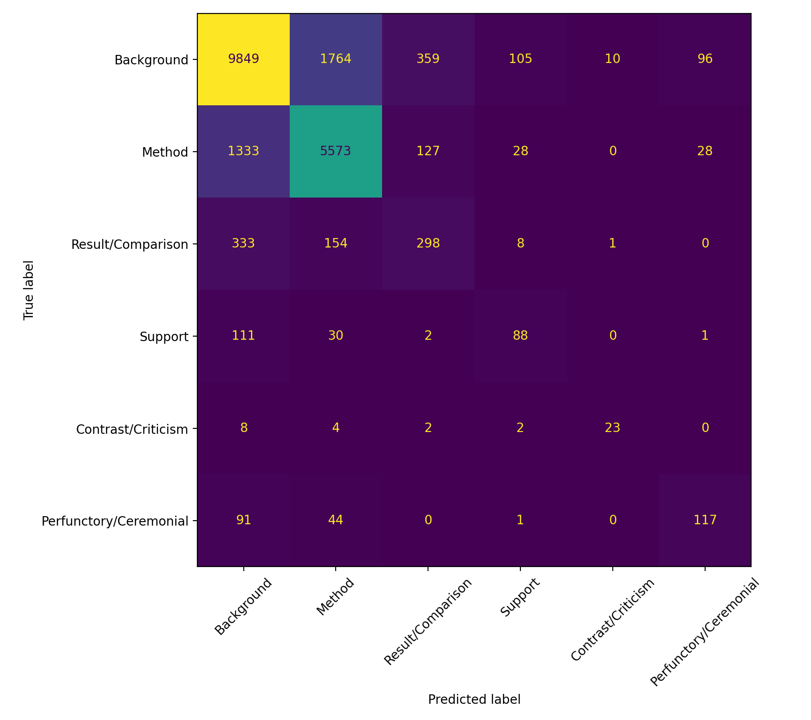
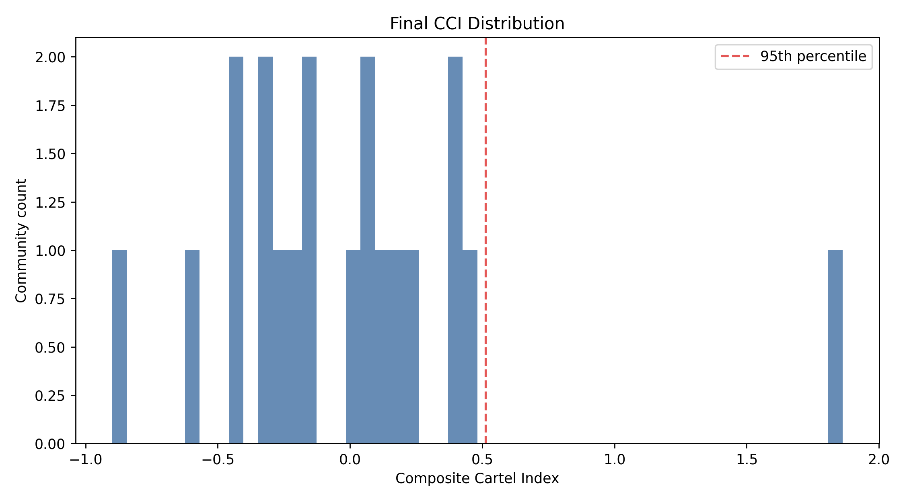
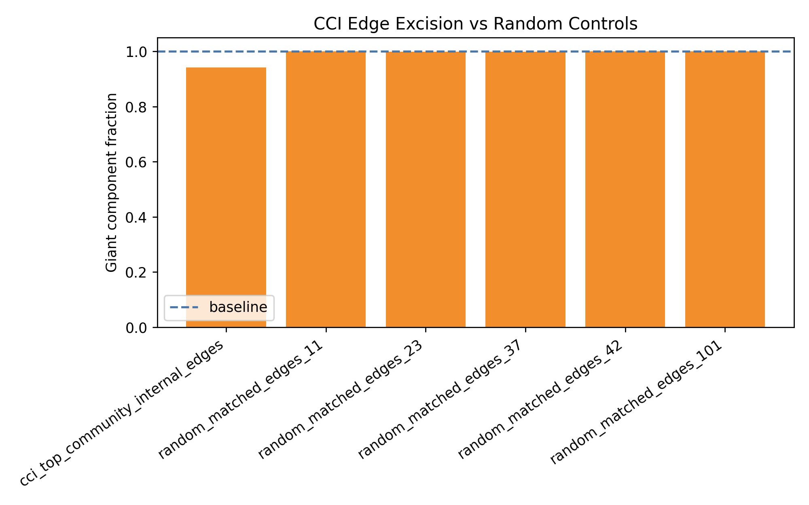

# Trust-Aware Citation Cartel Ranking in Scholarly Knowledge Graphs

We built an end-to-end system for finding suspicious citation communities in a
large scholarly knowledge graph. The central idea is that **citation cartels
cannot be detected reliably by graph structure alone**: legitimate research
areas also cite each other heavily. So we combine the topology of the citation
network with the semantic meaning of citation edges.

In simple terms, we do not only ask:

> Does this group cite itself unusually often?

We ask:

> Does this group cite itself unusually often, and do many of those citations
> look shallow, generic, or ceremonial?

The final output is a ranked audit queue of suspicious communities, supported
by semantic citation typing, graph anomaly scoring, baselines, ablation checks,
seed-stability checks, and edge-excision validation.

---

## What We Built

We started from a DBLP-derived citation graph and built a scalable
teacher-student pipeline:

```text
500K-paper citation graph
  -> canonical paper/edge tables
  -> structural sampling pools
  -> LLM teacher labels citation intent
  -> SciBERT student learns from teacher labels
  -> SciBERT types 2.04M citation edges
  -> semantic weighted graph
  -> Composite Cartel Index ranking
  -> baselines, ablations, stability, and excision validation
```

The important scale-up is:

```text
205,897 LLM teacher-labeled citation edges
       -> train SciBERT student
       -> 2,043,874 unique semantically typed citation edges
```

This lets us use an expensive LLM where it matters, then use SciBERT to scale
semantic typing to millions of graph edges.

---

## Results at a Glance

| Result | Value |
|---|---:|
| Papers in graph | 500,000 |
| Closed-world citation edges | 4,871,544 |
| LLM teacher-labeled edges | 205,897 |
| Unique semantically typed edges | 2,043,874 |
| Semantic graph coverage | 42.0% |
| SciBERT test accuracy | 0.775 |
| SciBERT weighted F1 | 0.775 |
| SciBERT macro F1 | 0.574 |

The highest-ranked community is a compact but extreme audit candidate:

| Top CCI Community Metric | Value |
|---|---:|
| Community size | 1,079 papers |
| Internal citation edges | 8,603 |
| Citation inflation vs expectation | 254.3x |
| Superficial typed internal citations | 64.2% |
| CCI score | 1.863 |

Our edge-excision validation also showed that removing 404,625 internal edges
from the top five CCI communities leaves 94.1% of nodes in the giant component,
while matched random removals leave 99.95-99.96%. This means the flagged
communities are locally cohesive and graph-visible, while most of the global
citation backbone remains intact.

---

## Visual Snapshot

### Citation Intent Distribution

We typed over two million citation edges into six semantic intent categories.
Most typed edges are Background or Method, while rare classes such as
Contrast/Criticism and Perfunctory/Ceremonial are still recovered and used in
community-level aggregate scoring.



### SciBERT Citation-Intent Classifier

SciBERT is trained as the student model. It learns to classify citation intent
from the citing paper title/abstract and cited paper title/abstract. We use it
for aggregate community semantics, not single-edge misconduct decisions.



### CCI Distribution and Edge Excision

The CCI distribution highlights the right-tail audit candidates. The excision
plot compares CCI-selected internal edge removal against matched random edge
removal.





---

## Why This Is Better Than the Original Notebook Prototype

The earlier `deliverable_2.ipynb` was a useful proof of concept for semantic
citation annotation. We turned that idea into a reusable, reproducible pipeline:

- We removed hardcoded key usage and moved credentials to environment variables.
- We created a structured `src/citation_cartels/` package.
- We added a central YAML configuration file.
- We prepared large Azure/OpenAI teacher-label batches safely.
- We parsed, audited, and merged 205,897 teacher labels.
- We trained and evaluated a SciBERT citation-intent classifier.
- We used SciBERT to type 2.04M unique citation edges.
- We merged teacher and student predictions into one semantic edge table.
- We computed weighted graph features and final CCI rankings.
- We added baselines, leave-one-feature ablations, seed stability, and edge
  excision validation.

The result is no longer just a notebook experiment. It is a full research
pipeline that can be rerun, audited, and extended.

---

## How the Teacher-Student System Works

The LLM teacher sees a citation pair:

```text
citing paper title + abstract
cited paper title + abstract
```

It assigns one of six labels:

| Label | Weight | Meaning |
|---|---:|---|
| Method | 1.0 | The citing work uses or extends the cited method/tool/dataset. |
| Result/Comparison | 0.7 | The citing work compares against or discusses related results. |
| Support | 0.5 | The cited work supports a claim. |
| Contrast/Criticism | 0.3 | The citing work disagrees with or critiques the cited work. |
| Background | 0.2 | The cited work provides broad but real context. |
| Perfunctory/Ceremonial | 0.1 | The citation appears weak, generic, or ceremonial. |

The teacher is accurate but expensive. SciBERT is cheaper and faster. We use
the teacher labels to train SciBERT, then use SciBERT to label many more edges.

This is the same idea as a professor grading examples, then a trained assistant
grading a much larger pile of similar examples.

---

## Composite Cartel Index

We rank each community using a Composite Cartel Index (CCI). CCI combines six
signals:

1. internal directed density,
2. citation inflation against degree-product expectation,
3. internal reciprocity,
4. semantic superficiality,
5. degree assortativity,
6. mean PageRank drop after semantic trust weighting.

Each feature catches a different failure mode:

| Feature | What It Captures |
|---|---|
| Density | Is the community unusually internally connected? |
| Inflation | Are internal citations much higher than expected from degree alone? |
| Reciprocity | Are papers mutually reinforcing each other? |
| Semantic superficiality | Are internal citations mostly shallow/background/perfunctory? |
| Assortativity | Are similarly connected nodes reinforcing each other? |
| Trust PageRank drop | Does influence fall when shallow citations are downweighted? |

We average normalized feature scores to get the final CCI ranking. The ranking
is meant for audit and explanation, not automatic fraud judgment.

---

## Validation We Ran

We did not stop at producing a score. We checked whether CCI is meaningful.

### Baselines

We compared CCI against:

- density-only,
- inflation-only,
- reciprocity-only,
- structural-only CCI,
- semantic-only superficiality,
- random ranking.

This checks whether CCI is just rediscovering a simple heuristic.

### Leave-One-Feature Ablation

We removed one CCI feature at a time and measured how much the ranking changed.
This checks whether the score is robust to feature choice.

### Seed Stability

We reran community detection with multiple Louvain seeds:

```text
11, 23, 37, 42, 101
```

This tells us how stable the audit queue is under different graph partitions.

### Edge Excision

We removed internal edges from the top CCI communities and compared the result
with matched random edge removal. This checks whether flagged communities form
concentrated local structures rather than random scattered edges.

---

## Project Directory Structure

```text
NS-Project/
│
├── README.md
├── requirements.txt
├── .env.example
├── .gitignore
│
├── configs/
│   └── cikm_middle.yaml
│
├── src/
│   └── citation_cartels/
│       ├── __init__.py
│       │
│       ├── data/
│       │   ├── __init__.py
│       │   └── build_tables.py
│       │
│       ├── annotation/
│       │   ├── __init__.py
│       │   ├── audit_labels.py
│       │   ├── build_sampling_pools.py
│       │   ├── combine_semantic_edges.py
│       │   ├── infer_student.py
│       │   ├── merge_teacher_labels.py
│       │   ├── parse_teacher_batch.py
│       │   ├── prepare_adaptive_inference_edges.py
│       │   ├── prepare_calibration_batch.py
│       │   ├── prepare_targeted_inference_edges.py
│       │   ├── prepare_teacher_batch.py
│       │   ├── prepare_teacher_batch_chunks.py
│       │   ├── prompt_templates.py
│       │   ├── retrieve_azure_batch.py
│       │   ├── submit_azure_batch.py
│       │   └── train_student.py
│       │
│       ├── graph/
│       │   ├── __init__.py
│       │   ├── cci_seed_stability.py
│       │   └── final_graph_analysis.py
│       │
│       └── reporting/
│           ├── __init__.py
│           └── package_graph_outputs.py
│
├── scripts/
│   ├── azure_graph_analysis_local.sh
│   ├── run_cci_seed_stability_cpu_vm.sh
│   ├── run_graph_analysis_cpu_vm.sh
│   ├── train_scibert_final.sh
│   └── train_scibert_local_mps.sh
│
├── graph_analysis_outputs/
│   ├── baseline_comparison.csv
│   ├── baseline_precision_at_k.csv
│   ├── cartel_community_scores_final.csv
│   ├── cartel_edge_excision_final.png
│   ├── cci_ablation.csv
│   ├── cci_distribution_final.png
│   ├── excision_results.csv
│   ├── excision_target_edges_manifest.json
│   ├── final_graph_analysis_manifest.json
│   ├── intent_distribution_final.csv
│   ├── intent_distribution_final.png
│   ├── top_communities_final.csv
│   └── seed_stability/
│       ├── cci_seed_stability.csv
│       ├── cci_seed_stability_manifest.json
│       ├── cci_seed_summary.csv
│       ├── seed_11/
│       ├── seed_23/
│       ├── seed_37/
│       ├── seed_42/
│       └── seed_101/
│
├── reports/
│   ├── scibert_local_mps/
│   │   ├── scibert_eval.json
│   │   └── scibert_confusion_matrix.png
│   └── teacher_labels_final_audit.json
│
├── data/
│   ├── raw/
│   ├── interim/
│   ├── labels/
│   └── processed/
│
├── models/
│   └── scibert_citation_intent_local_mps/
│
├── artifacts/
│   └── manifests/
│
├── azureml/
│   └── scibert_train_job.yml
│
├── deliverable_2.ipynb
├── deliverable_3.py
├── deliverable_3b.py
└── deliverable_4.py
```

Some folders such as `data/`, `models/`, and full artifact bundles are not
expected to be present in a lightweight clone. They are generated by the
pipeline or stored separately as large research artifacts.

---

## Setup

```bash
python3 -m venv .venv
source .venv/bin/activate
pip install -r requirements.txt
```

Copy the environment template if you need to run LLM or Azure steps:

```bash
cp .env.example .env
```

For local package imports:

```bash
export PYTHONPATH=src
```

---

## Running the Pipeline

### 1. Build Canonical Tables

```bash
PYTHONPATH=src python -m citation_cartels.data.build_tables \
  --config configs/cikm_middle.yaml
```

### 2. Build Sampling Pools

```bash
PYTHONPATH=src python -m citation_cartels.annotation.build_sampling_pools \
  --config configs/cikm_middle.yaml
```

### 3. Prepare Teacher Batch Chunks

```bash
PYTHONPATH=src python -m citation_cartels.annotation.prepare_teacher_batch_chunks \
  --config configs/cikm_middle.yaml \
  --target-labels 125000 \
  --chunk-size 25000 \
  --prefix teacher_final_125000
```

### 4. Submit, Retrieve, and Parse Teacher Labels

Submit:

```bash
PYTHONPATH=src python -m citation_cartels.annotation.submit_azure_batch \
  --config configs/cikm_middle.yaml \
  --batch-jsonl data/labels/<batch>.jsonl \
  --execute
```

Retrieve:

```bash
PYTHONPATH=src python -m citation_cartels.annotation.retrieve_azure_batch \
  --batch-id <batch_id> \
  --output data/labels/<responses>.jsonl
```

Parse:

```bash
PYTHONPATH=src python -m citation_cartels.annotation.parse_teacher_batch \
  --config configs/cikm_middle.yaml \
  --responses data/labels/<responses>.jsonl \
  --output data/labels/<labels>.parquet
```

### 5. Train SciBERT

```bash
scripts/train_scibert_local_mps.sh
```

### 6. Run Student Inference

```bash
PYTHONPATH=src python -m citation_cartels.annotation.infer_student \
  --config configs/cikm_middle.yaml \
  --model-dir models/scibert_citation_intent_local_mps/best_model \
  --edges data/processed/adaptive_inference_edges_1250k.parquet \
  --output-dir data/processed/typed_edges_adaptive_1250k_shards \
  --batch-size 32 \
  --edge-chunk-size 50000 \
  --skip-existing
```

### 7. Combine Semantic Edges

```bash
PYTHONPATH=src python -m citation_cartels.annotation.combine_semantic_edges \
  --config configs/cikm_middle.yaml \
  --student-dir data/processed/typed_edges_shards \
  --student-source student_initial_250k \
  --student-dir data/processed/typed_edges_targeted_800k_shards \
  --student-source student_targeted_350k \
  --student-dir data/processed/typed_edges_adaptive_1250k_shards \
  --student-source student_adaptive_1250k \
  --teacher-labels data/labels/teacher_labels_final.parquet \
  --output data/processed/semantic_edges_combined.parquet
```

### 8. Final Graph Analysis

```bash
PYTHONPATH=src python -m citation_cartels.graph.final_graph_analysis \
  --config configs/cikm_middle.yaml \
  --edges data/interim/edges.parquet \
  --papers data/interim/paper_metadata.parquet \
  --communities data/interim/pre_annotation_node_communities.parquet \
  --semantic-edges data/processed/semantic_edges_combined.parquet \
  --weighted-edges-output data/processed/weighted_edges.parquet \
  --output-dir graph_analysis_outputs
```

For Azure CPU execution:

```bash
scripts/run_graph_analysis_cpu_vm.sh
```

For seed stability:

```bash
scripts/run_cci_seed_stability_cpu_vm.sh
```

---

## Final Artifacts Worth Keeping

The most important large artifacts are:

```text
models/scibert_citation_intent_local_mps/best_model/
data/labels/teacher_labels_final.parquet
data/processed/semantic_edges_combined.parquet
data/processed/weighted_edges.parquet
data/processed/weighted_edges_stability.parquet
data/processed/typed_edges_shards/
data/processed/typed_edges_targeted_800k_shards/
data/processed/typed_edges_adaptive_1250k_shards/
graph_analysis_outputs/trust_pagerank_shifts.csv
graph_analysis_outputs/seed_stability/trust_pagerank_shifts.csv
artifacts/cikm_graph_analysis_outputs.tar.gz
```

`data/interim/` is useful for fast reruns, but it can be regenerated from the
raw sampled graph.

---

## How We Explain the Project

We built a trust-aware citation-cartel ranking system. We first use an LLM
teacher to label what citations mean, then train SciBERT to scale those labels
to millions of edges. We then turn semantic labels into trust weights and
combine them with graph anomaly signals. The final CCI score ranks communities
that are structurally inflated and semantically shallow, giving curators a
clear audit queue instead of a black-box accusation.

---

## License

This project is licensed under the MIT License.
