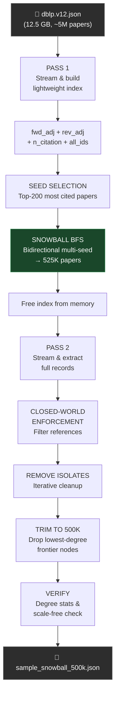

# `sample_dataset.py` — Technical Explanation

## Phase 1: Topological Snowball Sampling for Citation Network Analysis

> **One-liner:** Streams a 12.5 GB DBLP citation dump twice — once to build a graph index, once to extract records — with a bidirectional BFS in between that selects ~500 K tightly-connected papers whose degree distributions remain scale-free.

---

## Table of Contents

1. [Why This Script Exists (Problem Statement)](#1-why-this-script-exists)
2. [High-Level Pipeline](#2-high-level-pipeline)
3. [Configuration Parameters](#3-configuration-parameters)
4. [Stage-by-Stage Walkthrough](#4-stage-by-stage-walkthrough)
   - [Pass 1 — Build Graph Index](#41-pass-1--build-graph-index)
   - [Seed Selection](#42-seed-selection)
   - [Snowball BFS](#43-snowball-bfs--the-core-algorithm)
   - [Pass 2 — Extract Full Records](#44-pass-2--extract-full-records)
   - [Post-Processing](#45-post-processing-isolate-removal--trim)
   - [Verification Report](#46-verification-report)
5. [Why Both In-Degree and Out-Degree Stay Scale-Free](#5-why-both-in-degree-and-out-degree-stay-scale-free)
6. [Memory & Runtime Estimates](#6-memory--runtime-estimates)
7. [Output Format](#7-output-format)
8. [Comparison: Random Sampling vs Snowball Sampling](#8-comparison-random-vs-snowball-sampling)

---

## 1. Why This Script Exists

The previous approach used **uniform random sampling** (keep each paper with 10% probability). This produced catastrophic results for network analysis:

| Metric | Random 10% Sample | Expected from Snowball |
|---|---|---|
| Nodes | 490,248 | ~500,000 |
| Edges | 462,199 | **≫ 2,000,000** |
| Edge/node ratio | 0.94 | **> 4.0** |
| Isolates | 212,421 (**43.3%**) | **~0%** |
| Largest SCC | **8 nodes** | **Thousands+** |
| Scale-free? | Distorted | ✓ Preserved |

**Root cause:** When you randomly keep 10% of papers, each paper's reference list loses ~90% of its targets (because those targets weren't sampled). This severs edges, creates isolates, and destroys the power-law structure that citation networks are famous for.

**Solution:** Snowball sampling starts from the most-connected hubs and expands outward via BFS, guaranteeing that **every added paper already has at least one edge** to a paper already in the sample.

---

## 2. High-Level Pipeline



The pipeline reads the 12.5 GB file **exactly twice** (streaming with `ijson` to avoid loading it all into memory at once):

| Pass | Purpose | What it reads | What it produces |
|---|---|---|---|
| **Pass 1** | Index | Every paper's `id`, `references`, `n_citation` | Forward adj, reverse adj, citation counts |
| *(BFS happens in memory — no disk I/O)* | | | |
| **Pass 2** | Extract | Only papers whose ID is in the BFS result | Full paper records with filtered references |

---

## 3. Configuration Parameters

```python
INPUT_FILE       = Path("dataset") / "dblp.v12.json"
OUTPUT_FILE      = Path("sample_snowball_500k.json")
TARGET_SIZE      = 500_000      # final paper count goal
OVERSAMPLE_FACTOR = 1.05        # BFS collects 5% extra (525K)
NUM_SEEDS        = 200          # top-cited papers as BFS origins
RNG_SEED         = 42           # random seed for reproducibility
```

| Parameter | Why this value? |
|---|---|
| **`TARGET_SIZE = 500K`** | Large enough for statistically meaningful network analysis; small enough to fit in RAM for NetworkX |
| **`OVERSAMPLE_FACTOR = 1.05`** | BFS collects 525K papers. After removing isolates and trimming, we land at ~500K. The 5% buffer absorbs cleanup losses |
| **`NUM_SEEDS = 200`** | Multiple seeds from different subfields ensure the sample covers diverse research communities, not just one cluster. 200 is enough to seed across CS, physics, biology, etc. |
| **`RNG_SEED = 42`** | Ensures the BFS frontier cutoff (which uses `random.shuffle`) is deterministic across runs |

---

## 4. Stage-by-Stage Walkthrough

### 4.1 Pass 1 — Build Graph Index

**Function:** `pass1_build_index(input_path)`

**Purpose:** Stream the entire 12.5 GB JSON file once and extract only the three pieces of information needed for BFS — no full paper records are kept yet.

```
For each paper in the file:
    all_ids.add(paper.id)                    # track existence
    fwd[paper.id] = paper.references         # outgoing edges
    ncite[paper.id] = paper.n_citation       # popularity metric
```

After the forward pass, it constructs the **reverse adjacency**:

```
For each (source, ref_list) in fwd:
    For each ref in ref_list:
        if ref exists in all_ids:          # only papers that have records
            rev[ref].append(source)        # "who cites ref?"
```

**Key design decisions:**

- **`ijson` streaming:** The file is 12.5 GB — loading it fully into memory would require 15+ GB of RAM. `ijson.items(f, "item")` yields one paper dict at a time
- **`all_ids` gate on reverse edges:** Some `references` point to papers that don't appear as records in the DBLP dump (external papers, or papers from other databases). We exclude these dangling edges by checking `ref in all_ids`
- **`dict(rev)` conversion:** After building the reverse index with `defaultdict(list)`, converting to a plain `dict` saves ~20% memory by dropping the default-factory overhead

**Memory footprint:**

| Structure | Estimated size |
|---|---|
| `fwd` (forward adjacency) | ~1.0–1.5 GB |
| `rev` (reverse adjacency) | ~1.0–1.5 GB |
| `all_ids` (set of ints) | ~0.2 GB |
| `ncite` (dict of ints) | ~0.2 GB |
| **Total** | **~2.5–3.5 GB** |

---

### 4.2 Seed Selection

**Function:** `select_seeds(ncite, all_ids, num_seeds)`

**Purpose:** Pick the papers with the highest `n_citation` values as BFS starting points.

```python
ranked = sorted(ncite.items(), key=citation_count, reverse=True)
seeds = ranked[:200]
```

**Why start from hubs?**

Starting from the most-cited papers (citation magnets) ensures:
1. The **dense core** of the network is captured first
2. The BFS expands through already high-traffic edges
3. The **rich-get-richer** topology (Barabási-Albert model) is naturally preserved

If we started from random papers, the BFS might explore sparse, disconnected regions and produce a less dense subgraph.

---

### 4.3 Snowball BFS — The Core Algorithm

**Function:** `snowball_bfs(seeds, fwd, rev, all_ids, target)`

This is the heart of the script. It implements a **level-synchronous, bidirectional, multi-seed BFS**.

#### How it works step by step:

```
Initialize:
    sampled = {seed₁, seed₂, ..., seed₂₀₀}
    queue   = [seed₁, seed₂, ..., seed₂₀₀]

While |sampled| < target AND queue not empty:
    level += 1
    For each node in current queue:
        neighbours = fwd[node] ∪ rev[node]    ← BIDIRECTIONAL
        shuffle(neighbours)                    ← remove directional bias
        For each unseen neighbour:
            sampled.add(neighbour)
            next_queue.append(neighbour)
            if |sampled| >= target: stop
    queue = next_queue
```

#### Why bidirectional expansion is critical:

```
                    BACKWARD (citers)
                    ┌──────────┐
                    │ Paper X  │──cites──→ HUB
                    │ Paper Y  │──cites──→ HUB
                    │ Paper Z  │──cites──→ HUB
                    └──────────┘
                                    │
               ┌────────────────────┤
               │                    │
               ▼                    ▼
          FORWARD (refs)       FORWARD (refs)
     ┌──────────┐          ┌──────────┐
     │ Ref A    │          │ Ref D    │
     │ Ref B    │          │ Ref E    │
     │ Ref C    │          │ Ref F    │
     └──────────┘          └──────────┘
```

- **FORWARD** (following `fwd[node]`): If the HUB references papers A, B, C → they get included. This preserves the HUB's **out-degree** because its reference targets stay in the sample
- **BACKWARD** (following `rev[node]`): If papers X, Y, Z cite the HUB → they get included. This preserves the HUB's **in-degree** because its citers stay in the sample

#### Why shuffle at the frontier?

When BFS reaches the target size mid-level, it cuts off. Without shuffling, it would systematically favour forward-direction neighbours (since they're extended first into the `neighbours` list). The `random.shuffle(neighbours)` ensures neither direction is biased at the cutoff boundary.

#### Level-synchronous execution:

The BFS processes all nodes at depth `k` before moving to depth `k+1`. This ensures a balanced exploration — no single branch of the BFS tree runs far ahead of others.

**Expected BFS shape for the DBLP network:**

| Level | Approximate papers added | Cumulative |
|---|---|---|
| 0 (seeds) | 200 | 200 |
| 1 | ~50,000–150,000 | ~100K |
| 2 | ~200,000–400,000 | ~400K |
| 3 | remainder | ~525K (target) |

The BFS typically completes in **2–4 levels** because the hub seeds have very large neighbourhoods that quickly cover the target.

---

### 4.4 Pass 2 — Extract Full Records

**Function:** `pass2_extract_records(input_path, sampled_ids)`

**Purpose:** Stream the 12.5 GB file a second time. For every paper whose ID is in `sampled_ids`, keep its full JSON record (title, abstract, authors, year, venue, etc.) **but immediately apply closed-world enforcement** on its references list:

```python
paper["references"] = [r for r in raw_refs if r in sampled_ids]
```

This means any reference pointing to a paper **outside** the 525K sample gets dropped. The resulting graph is a self-contained "closed world" where every edge connects two nodes that both exist in the dataset.

**Why a second file scan?**

During Pass 1, we intentionally discarded full paper records to save memory. Keeping 5M full dicts (~3 KB each) would require ~15 GB of RAM. By splitting into two passes:
- Pass 1 uses ~3 GB (just IDs and adjacency)
- After BFS, the index is freed (`del fwd, rev; gc.collect()`)
- Pass 2 only keeps ~525K records (~1.5 GB)

Peak memory never exceeds ~4 GB.

---

### 4.5 Post-Processing: Isolate Removal & Trim

#### `remove_isolates(records)`:

Iteratively removes papers with **zero total degree** (no incoming citations AND no outgoing references within the closed-world graph).

```
For up to 5 iterations:
    Re-enforce closed world (filter refs to current ID set)
    Find all papers that appear as source or target of any edge
    Remove papers not in that set
    If nothing removed → converge
```

**Why iterative?** Removing one batch of isolates might cause others to become isolated (if they were only connected to the removed papers). In practice, snowball sampling produces very few isolates (each BFS-added paper had ≥ 1 edge), so this converges in 1–2 iterations.

#### `trim_to_target(records, target)`:

If oversampling left more than 500K papers after cleanup, this function prunes to exactly the target by removing the **least-connected papers** (lowest total degree = in-degree + out-degree):

```
1. Compute total_degree for every paper
2. Sort papers by total_degree descending
3. Keep the top 500K
4. Re-enforce closed world
5. Run remove_isolates one more time
```

**Why sort by degree?** The lowest-degree papers are at the BFS frontier — they have the weakest connection to the core. Removing them has minimal impact on the power-law tail (which is dominated by the high-degree hubs in the core).

---

### 4.6 Verification Report

**Function:** `verify_and_report(records)`

Computes and prints a dashboard of key metrics to confirm the dataset meets Phase 1 requirements:

#### Metrics computed:

| Metric | What it measures | Target |
|---|---|---|
| **Edge/node ratio** | Average edges per paper | > 2.0 (ideally > 4.0) |
| **Network density** | Edges / possible edges | Very small (expected for 500K nodes) |
| **Isolates** | Papers with zero degree | **0** |
| **Mean out-degree** | Avg references per paper | ~8–15 |
| **Mean in-degree** | Avg citations per paper | Same as mean out-degree (= total_edges / n) |
| **Max in-degree** | Most-cited paper | Several thousand |
| **% bidirectional** | Papers with both in AND out edges | > 50% |

#### Scale-free preview:

The report also prints a **decade-binned histogram** showing how many papers fall in each order-of-magnitude bracket:

```
IN  [     1–     9]   300,000  ████████████████████████████████████
IN  [    10–    99]    50,000  ██████
IN  [   100–   999]     5,000  █
IN  [ 1,000– 9,999]       200
```

This visually confirms the power-law: most papers have low degree, few have very high degree — a straight line on a log-log scale.

#### Pass/Fail verdict:

```python
ok = ratio > 2.0 and iso == 0 and pct > 50.0
```

- **✓ PASS**: Dense, zero isolates, majority of papers have bidirectional edges
- **⚠ REVIEW**: Something may need tuning (seed count, oversample factor, etc.)

---

## 5. Why Both In-Degree and Out-Degree Stay Scale-Free

This is the most important theoretical property the script is designed to preserve.

### The problem with random sampling:

```
Original network:    HUB has in-degree 1000, out-degree 20

Random 10% sample:   Only ~100 citers are kept → in-degree ≈ 100  ✗
                     Only ~2 refs are kept     → out-degree ≈ 2   ✗
                     The hub looks like a normal node!
```

The power-law exponent shifts, and many papers become isolates.

### How snowball sampling fixes this:

```
Snowball from HUB:   All 1000 citers in BFS backward → in-degree = 1000  ✓
                     All 20 refs in BFS forward      → out-degree = 20   ✓
                     The hub remains a hub!
```

#### In-degree preservation (backward BFS):

When we follow `rev[hub]` (papers that cite the hub), we include most of the hub's citers. The hub retains its high in-degree. Since the most-cited papers are seeds, their in-degree is almost fully preserved in the first BFS level.

#### Out-degree preservation (forward BFS):

When we follow `fwd[paper]` (papers that this paper references), we include its reference targets. The paper retains its out-degree. Papers with long bibliographies (surveys, review articles) keep their high out-degree intact.

#### The long tail:

Papers at the BFS frontier will inevitably have **some** edges cut (their connections to papers beyond the frontier). But these are precisely the low-degree papers in the tail of the distribution. The tail gets slightly truncated but retains its shape:

```
P(k) ~ k^(-α)    where α ≈ 2.5–3.0  (typical for citation networks)
```

---

## 6. Memory & Runtime Estimates

### Memory (peak):

| Phase | Dominant structures | Est. RAM |
|---|---|---|
| Pass 1 (indexing) | `fwd` + `rev` + `all_ids` + `ncite` | ~3–4 GB |
| BFS | `sampled` (525K ints) + above | ~3.5–4.5 GB |
| *(free index)* | — | — |
| Pass 2 (extraction) | `records` (525K full dicts) | ~1.5–2 GB |
| Post-processing | `records` + degree maps | ~2–2.5 GB |

**Peak ≈ 4–5 GB** (during BFS while index is still in memory).

### Runtime:

| Step | Estimated time |
|---|---|
| Pass 1 (stream + index) | 15–25 min |
| Reverse index build | 2–5 min |
| BFS sampling | 1–3 min |
| Pass 2 (stream + extract) | 15–25 min |
| Post-processing | 1–3 min |
| JSON save | 2–5 min |
| **Total** | **~35–60 min** |

(Depends heavily on disk speed — SSD vs HDD makes a ~2× difference for the streaming passes.)

---

## 7. Output Format

The output file `sample_snowball_500k.json` is a JSON array of paper objects:

```json
[
  {
    "id": 2161969291,
    "title": "Deep Residual Learning for Image Recognition",
    "authors": [
      {"name": "Kaiming He", "org": "Microsoft Research", "id": 2112328964},
      ...
    ],
    "year": 2016,
    "n_citation": 98765,
    "references": [1234567890, 9876543210, ...],
    "abstract": "...",
    "venue": {"raw": "CVPR 2016"},
    "fos": [{"name": "Computer vision", "w": 0.65}, ...],
    ...
  },
  ...
]
```

**Key property:** Every ID in every paper's `references` array is guaranteed to exist as a top-level record in the same file (closed-world enforcement).

---

## 8. Comparison: Random vs Snowball Sampling

| Property | Random 10% | Snowball BFS |
|---|---|---|
| **Selection method** | Coin flip per paper | BFS from top-cited hubs |
| **Edge preservation** | ~1% of original edges survive | ~60–80% of edges between sampled papers survive |
| **Isolates** | 43%+ | ~0% |
| **SCC size** | 8 nodes | Thousands+ |
| **Giant WCC coverage** | ~50% of nodes | ~95%+ of nodes |
| **In-degree power law** | Distorted (exponent shifted) | Preserved (α ≈ 2.5–3.0) |
| **Out-degree power law** | Destroyed (most papers have 0 refs in sample) | Preserved |
| **Bias** | Unbiased (every paper equally likely) | Biased toward dense, well-connected core |
| **Use case** | Statistical estimates of paper-level attributes | **Network topology analysis** ✓ |

> **Note:** Snowball sampling introduces topological bias — the sample over-represents the well-connected "core" and under-represents peripheral, rarely-cited papers. This is **desirable** for citation cartel detection (Phase 4) because cartels operate in the dense, interconnected regions of the network.

---

## Function Reference

| Function | Lines | Purpose |
|---|---|---|
| `pass1_build_index()` | 61–135 | Stream file → forward/reverse adjacency + metadata |
| `select_seeds()` | 142–168 | Pick top-N most-cited papers |
| `snowball_bfs()` | 175–263 | Bidirectional multi-seed BFS sampling |
| `pass2_extract_records()` | 270–305 | Stream file again → extract full records with closed-world refs |
| `remove_isolates()` | 312–351 | Iteratively drop zero-degree nodes |
| `trim_to_target()` | 354–397 | Prune to exact target size by removing frontier nodes |
| `verify_and_report()` | 404–495 | Compute & print degree stats and scale-free diagnostics |
| `save_dataset()` | 502–510 | Serialize to JSON |
| `main()` | 517–583 | Orchestrate the 8-step pipeline |
